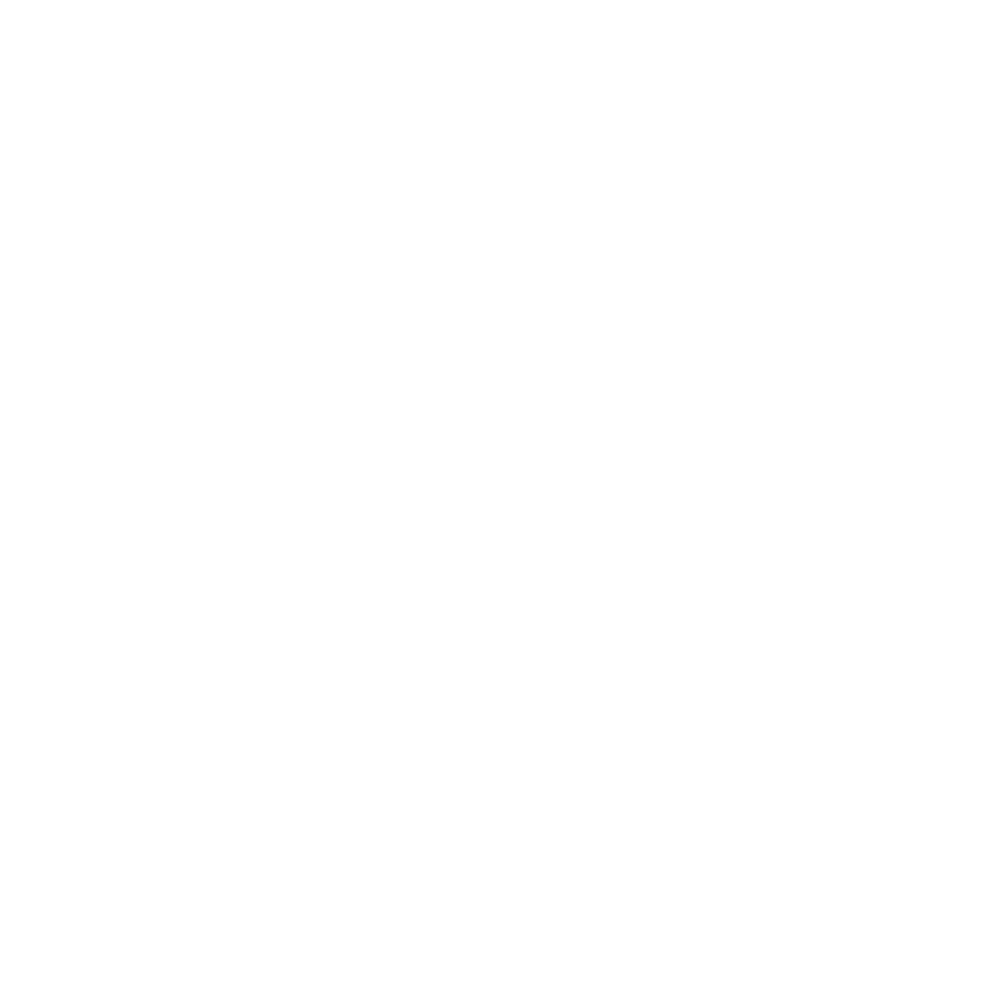

<h1>Hey there, I'm  <a href="https://www.abintimilsina.com.np/" style="text-decoration:none; color:white">Avin</a></h1>

<h4>I'm a novice programmer that has a burning desire to learn and develop my coding abilities.</h4>
 
<h3>🛠 Technologies and tools:</h3>

      
    
    
    
     
        
    
    
    
    
    
    
     
    
    
    
    
    
    
     
    

 
<h3>🤖 Github Statistics:</h3>
<table>
  <tr>
    <td>
      
    </td>
    <td>
      
    </td>
  </tr>
  <tr>
  <td >
  
    </td>
    <td>
     
    </td>
   
</table>
 

### 📫 Reach me at

  &nbsp;&nbsp;&nbsp;&nbsp;
  &nbsp;&nbsp;&nbsp;&nbsp;
  &nbsp;&nbsp;&nbsp;&nbsp;
  &nbsp;&nbsp;&nbsp;&nbsp;
  &nbsp;&nbsp;&nbsp;&nbsp;
  </a>
 

<h3>👀Github Visits :</h3>

